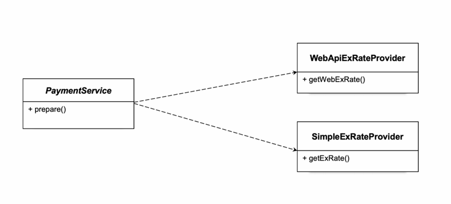

# 04.클래스의 분리

관심사에  따라  클래스를  분리해서  각각  독립적으로  구성할  수  있다 . 결과적으로  클래스  레벨에  사용  의존관계가  만들어지기  때문에  **강한  코드  수준의  결합이  생긴다** .  실제로  **사용할  클래스가  변경 되면**  이를  **이용하는  쪽의  코드도**  **변경되야한다**.  상속을  통한  확장처럼 유연한 변경도 불가능해진다. **상속한  것이  아니기  때문에**  사용하는  클래스의  메소드  **이름과 구조도 제각각**일 수 있다. 그래서 클래스가 변경되면 많은 코드가 변경되어야 한다. 클래스가 다르다는 것을 제외하면 관심사의 분리가 잘 된 방법이  아니다 .




두가지 클래스를 상속을 하지않고, 분리할 것이다.(의존관계)

- **PaymentService**

  - abstract제거
  - 사용하는 클래스 싱글톤 적용.

  ```java
  import java.io.IOException;
  import java.math.BigDecimal;
  import java.time.LocalDateTime;
  
  public class PaymentService {
          private final SimpleExRateProvider exRateProvider;
          public PaymentService(){
              this.exRateProvider = new SimpleExRateProvider();
          }
  
      public Payment prepare(Long orderId, String currency, BigDecimal foreignCurrencyAmount) throws IOException {
          BigDecimal exRate = exRateProvider.getExRate(currency);
          BigDecimal convertedAmount = foreignCurrencyAmount.multiply(exRate);
          LocalDateTime validUntil = LocalDateTime.now().plusMinutes(30);
  
          return new Payment(orderId, currency, foreignCurrencyAmount, exRate, convertedAmount, validUntil);
      }
  }
  ```

- **SimpleExRateProvider, WebApiExRateProvider**

  상속을 제거하고, 클래스를 분리시켰다.

  ```java
  public class SimpleExRateProvider {
  
      BigDecimal getExRate(String currency) throws IOException {
          if(currency.equals("USD")) return BigDecimal.valueOf(1000);
  
          throw new IllegalArgumentException("지원하지 않는 통화입니다.");
      }
  }
  
  ------------------------------------------------------------- 
  public class WebApiExRateProvider {
  
      BigDecimal getExRate(String currency) throws IOException {
          URL url = new URL("<https://open.er-api.com/v6/latest/>" + currency);
          HttpURLConnection connection = (HttpURLConnection) url.openConnection();
          BufferedReader br = new BufferedReader(new InputStreamReader(connection.getInputStream()));
          String response = br.lines().collect(Collectors.joining());
          br.close();
  
          ObjectMapper mapper = new ObjectMapper();
          ExRateData data = mapper.readValue(response, ExRateData.class);
          return data.rates().get("KRW");
      }
  }
  ```

여전한 문제점은 **PaymentService에서** 사용하는 provider가 달라질때마다 싱글톤 적용부분 수정이 필요하다는 점과 두 Provider의 메서드 명이 다르면 또 변경이 필요하다 → 번거로움 → 이름을 통일하고, 변경 안 하고 싶음 이문제를 해결하기위해 다음시간에는 **인터페이스를 도입**한다.
