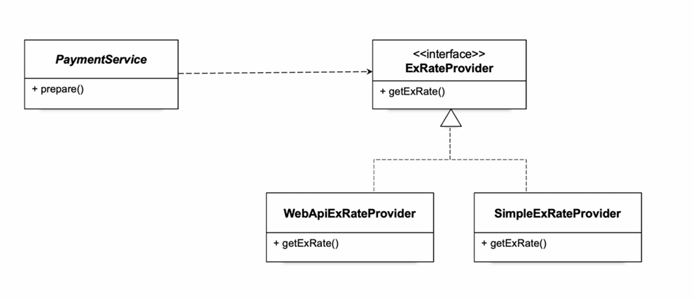

# 05.인터페이스 도입

독립적인 인터페이스를 정의하고 PaymentService가 사용할 **메소드 이름을 정해둔다**.  이를 각 클래스가 구현하게 만들면 이를 사용하는 쪽에서 의존하는 클래스가 변경되더라도 사용하는 메소드 이름의 변경이 일어나지 않는다. 하지만, 클래스의 인스턴스를 만드는 생성자를 호출하는 코드에는 클래스 이름이 등장하기 때문에 사용하는 환율 정보를  가져오는 클래스가 변경되면 PaymentService의 코드도 일부분이지만 변경되어야 한다 . 여전히 상속을 통한 확장 만큼의 유연성도 가지지 못한다 .

인터페이스를 통해서 동일한 이름으로 사용하고 확장 할 수 있게함. 재사용성이 좋아질거같다.



- 인터페이스 생성.

  ```java
  package tobyspring.hellospring;
  
  import java.io.IOException;
  import java.math.BigDecimal;
  
  public interface ExRateProvider {
      BigDecimal getExRate(String currency) throws IOException;
  }
  ```

- 인터페이스 구현

  ```java
  public class SimpleExRateProvider implements ExRateProvider{
  
      @Override
      public BigDecimal getExRate(String currency) throws IOException {
          if(currency.equals("USD")) return BigDecimal.valueOf(1000);
  
          throw new IllegalArgumentException("지원하지 않는 통화입니다.");
      }
  }
  --------------------------------------------------------------------------
  public class WebApiExRateProvider implements ExRateProvider{
  
      @Override
      public BigDecimal getExRate(String currency) throws IOException {
          URL url = new URL("<https://open.er-api.com/v6/latest/>" + currency);
          HttpURLConnection connection = (HttpURLConnection) url.openConnection();
          BufferedReader br = new BufferedReader(new InputStreamReader(connection.getInputStream()));
          String response = br.lines().collect(Collectors.joining());
          br.close();
  
          ObjectMapper mapper = new ObjectMapper();
          ExRateData data = mapper.readValue(response, ExRateData.class);
          return data.rates().get("KRW");
      }
  }
  ```

- **PaymentService**

  ```java
  public class PaymentService {
          private final ExRateProvider exRateProvider;
          public PaymentService(){
  //            this.exRateProvider = new SimpleExRateProvider(); // 이부분만 수정해서 사용할수이따.
              this.exRateProvider = new WebApiExRateProvider();
          }
  
      public Payment prepare(Long orderId, String currency, BigDecimal foreignCurrencyAmount) throws IOException {
          BigDecimal exRate = exRateProvider.getExRate(currency);
          BigDecimal convertedAmount = foreignCurrencyAmount.multiply(exRate);
          LocalDateTime validUntil = LocalDateTime.now().plusMinutes(30);
  
          return new Payment(orderId, currency, foreignCurrencyAmount, exRate, convertedAmount, validUntil);
      }
  }
  ```

인터페이스를 적용해 다형성을 이용해서 인스턴스를 생성해 사용할 수 있고, 메서드 이름도 같기때문에 따로 변경이 필요없다. 하지만 여전히 변경해야하는 부분이 있고, 결합도가 높은 것을 알 수 있다. 다음 시간에는 이 결합도를 낮추는 방법을 알아보자.

```java
//this.exRateProvider = new SimpleExRateProvider(); // 이부분만 수정해서 사용할수이따.
this.exRateProvider = new WebApiExRateProvider();
```