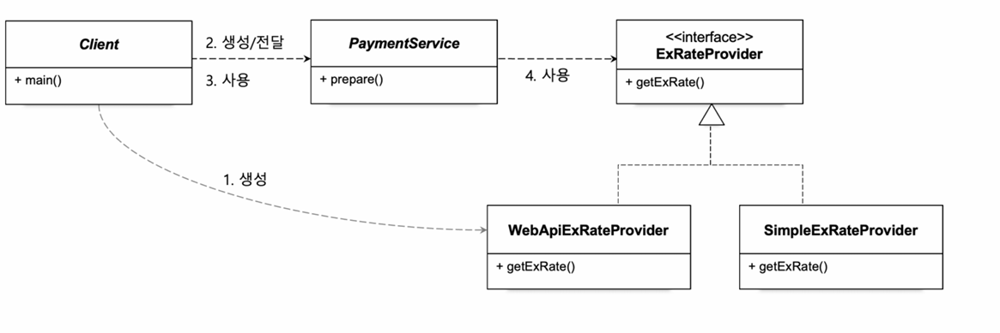

# 06.관계설정\_책임의_분리


`PaymentService`가 어떤 Provider를 사용할 것인가 => 관계 설정

현재 코드에서는 런타임 의존 관계로 `WebApiExRateProvider`와 `SimpleExRateProvider` 둘 중 어느 것을 사용하는지 설정하는 부분이 `PaymentService` 생성자 안에 있다. 이런 것을 분리하는 것을 관계 설정 책임의 분리라고 한다.

그래서 기존 코드에서 이를 `Client`가 `WebApiExRateProvider`와 `SimpleExRateProvider` 둘 중 어느 것을 사용하는지 설정하도록 하는 것이 관계 설정 책임의 분리 작업을 했다고 할 수 있다.

그림과 같이 분리함



---

## 코드 반영

- `PaymentService`
  다형성을 이용해 생성자에서 인터페이스 `ExRateProvider`를 매개변수로 전달받고 생성함.

  ```java
  public class PaymentService {
          private final ExRateProvider exRateProvider;
          public PaymentService(ExRateProvider exRateProvider){
              this.exRateProvider = exRateProvider;
          }
  
      public Payment prepare(Long orderId, String currency, BigDecimal foreignCurrencyAmount) throws IOException {
          BigDecimal exRate = exRateProvider.getExRate(currency);
          BigDecimal convertedAmount = foreignCurrencyAmount.multiply(exRate);
          LocalDateTime validUntil = LocalDateTime.now().plusMinutes(30);
  
          return new Payment(orderId, currency, foreignCurrencyAmount, exRate, convertedAmount, validUntil);
      }
  }
  ```

- `Client`
  사용할 클래스를 클라이언트에서 직접 넘겨준다.

  ```java
  public class Client {
      public static void main(String[] args) throws IOException {
          PaymentService paymentService = new PaymentService(new WebApiExRateProvider());
          Payment payment = paymentService.prepare(100L, "KRW", BigDecimal.valueOf(50.7));
          PaymentService paymentService2 = new PaymentService(new SimpleExRateProvider());
          Payment payment2 = paymentService2.prepare(100L, "USD", BigDecimal.valueOf(50.7));
          System.out.println(payment);
          System.out.println(payment2);
      }
  }
  ```

  