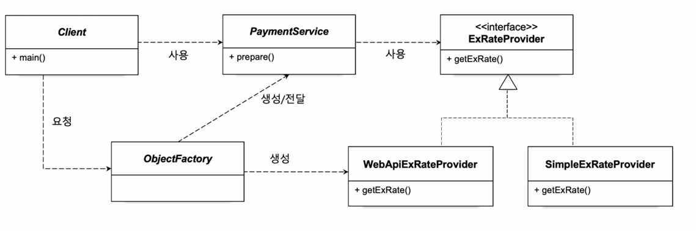

# 07.오브젝트_팩토리


현재 문제점

- Client는 2개의 관심사를 가진다.
  - PaymentService를 이용하는 클래스인데, 어떤 클래스를 사용할 것이지 또한 결정하는 역할을 한다.
  - 그래서 이번에는 Client가 PaymentService를 이용하는 관심사만 가지도록 코드를 개선해본다.




- Client

  ```java
  public class Client {
      public static void main(String[] args) throws IOException {
          ObjectFactory objectFactory = new ObjectFactory();
          PaymentService paymentService = objectFactory.paymentService();
  
          Payment payment = paymentService.prepare(100L, "USD", BigDecimal.valueOf(50.7));
          System.out.println(payment);
      }
  }
  ```

  사용할 ExRateProvider를 결정하지 않도록 수정됨.

- ObjectFactory 생성

  ```java
  public class ObjectFactory {
      public PaymentService paymentService() {
          return new PaymentService(exRateProvider());
      }
  
      public ExRateProvider exRateProvider(){
          return new WebApiExRateProvider();
      }
  }
  ```

  사용할 ExRateProvider를 결정해 넘겨주는 역할, 수정이 필요할 때 이름을 보고 수정할 부분을 찾기 쉽게하려고 exRateProvider메서드를 만들었다.