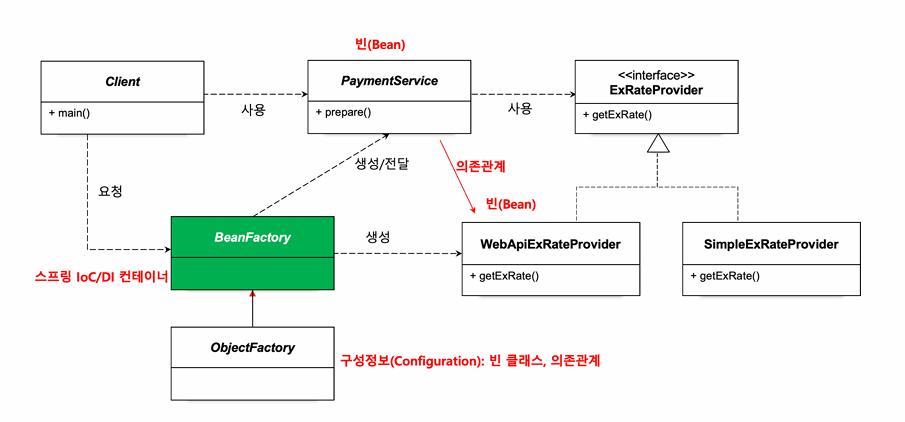

# 스프링\_컨테이너와\_의존관계_주입

Spring BeanFactory가 ObjectFactory가 제공하는 기능을 대체함. BeanFactory 는 ObjectFactory의 구성 정보를 참고해서 동작하게 한다.
(ObjectFactory 코드 변경없이 @Configuration 사용, 메서드에는 @Bean 사용함)

## 의존관계 주입

IoC는 스프링의 동작원리를 정확히 설명하기에는 너무 일반적인 프레임워크 동작원리를 설명하는 용어다.

그래서 스프링과 같이 오브젝트의 의존관계에 대함 책임을 스프링과 같은 외부 오브젝트가 담당하도록 만든 것을 설명하는 의존관계주입(Dependency Injection) 패턴 DI라고 부르기로 함.

스프링이 처음 등장한 시기에 IoC라는 용어를 주로 사용했기에 DI를 사용하면서도 IoC라는 용어도 같이 쓰임.(IoC/DI)

## 컨테이너

애플리케이션을 구성하는 오브젝트를 만들어서 담아두고 사용할 때 꺼내 쓰도록 하는 것.
보관 뿐 아니라 생명주기도 담당함. 스프링 컨테이너는 빈 오브젝트를 생성하고 의존관계를 설정과 빈 오브젝트 생명주기 담당하는 기능 제공.

### 정리

그러니까 이번시간에는 스프링에서 해주는 기능을 사용해봤는데, BeanFactory를 사용한 것이고, BeanFactory는 우리가 만든 ObjectFactory에 정의된 클래스들(Bean)을 참고해서 요청하는 측이 BeanFactory한테 필요한 클래스 정보를 넘겼을 때 그 클래스를 넘겨준다는 것이다. 그렇다면 왜 ObjectFactory에서 바로 사용하면 되는데 굳이 BeanFactory를 사용하는 것 인가에 대한 의문이 든다. 어쨌든 ObjecFactory에서 다이렉트로 정보를 받아다 쓰면 되는데 왜 굳이 ??

---

### GPT 답

ObjectFactory 대신 BeanFactory를 사용하는 이유는 **확장성, 편의성, 그리고 관리의 일관성** 때문입니다. 다음과 같은 이유에서 BeanFactory가 더 유리합니다.

---

### 1. **확장성과 유연성**
- **BeanFactory는 Spring 프레임워크의 핵심 컨테이너**로, 단순히 객체 생성만이 아니라 의존성 주입(DI), 생명주기 관리 등 더 많은 기능을 제공합니다.
- ObjectFactory는 객체 생성에 초점이 맞춰져 있지만, BeanFactory는 스프링 전반의 다양한 기능과 쉽게 통합됩니다.
  - 예: 스코프 관리(`singleton`, `prototype`), 지연 로딩(`lazy initialization`), AOP 적용 등.

---

### 2. **DI(의존성 주입) 및 컨테이너 기능**
- ObjectFactory를 직접 사용하면, 필요한 의존성을 수동으로 관리해야 합니다.
- BeanFactory는 의존성을 자동으로 주입(DI)해주며, 객체 간의 의존 관계를 쉽게 관리합니다.
  - 개발자는 객체 간의 의존성을 고민하지 않고 **"필요한 객체를 요청"**하면 BeanFactory가 알아서 관리하고 제공합니다.

---

### 3. **일관성과 표준화**
- BeanFactory는 스프링 프레임워크의 **표준 컨테이너** 역할을 합니다. 이로 인해 개발자가 **하나의 방식으로 객체를 생성하고 관리**할 수 있습니다.
- 직접 ObjectFactory를 사용할 경우, 각 객체 생성 로직을 별도로 작성해야 하고, 이로 인해 **코드 중복**과 **비효율**이 발생할 수 있습니다.

---

### 4. **생명주기 관리**
- BeanFactory는 객체 생성뿐만 아니라 **생명주기(lifecycle)를 관리**합니다.
  - 초기화 및 소멸 메서드 호출, 의존성 주입 완료 시점에서 후처리 등.
- ObjectFactory를 사용할 경우, 생명주기 관리는 개발자가 직접 처리해야 하므로 복잡도가 증가합니다.

---

### 5. **스프링 컨텍스트와의 통합**
- BeanFactory는 Spring ApplicationContext의 기본 구성요소로 사용됩니다.
  - ApplicationContext는 BeanFactory를 확장하여 더 강력한 기능(예: 이벤트 발행/구독, 메시지 리소스 관리)을 제공합니다.
  - ObjectFactory는 이러한 스프링 컨텍스트 기능과 통합하기 어렵습니다.

---

### 결론
ObjectFactory 대신 BeanFactory를 사용하는 이유는, **단순한 객체 생성 이상의 다양한 기능(의존성 관리, 생명주기 관리, 확장성)을 제공**하기 때문입니다.  
이러한 기능은 개발자의 작업을 단순화하고, 대규모 애플리케이션에서 일관성과 유지보수성을 높입니다.  

ObjectFactory는 단순 객체 생성용으로는 적합하지만, 의존성 주입이나 생명주기 관리 등 복잡한 기능을 처리하기에는 BeanFactory만큼 효율적이지 않습니다.