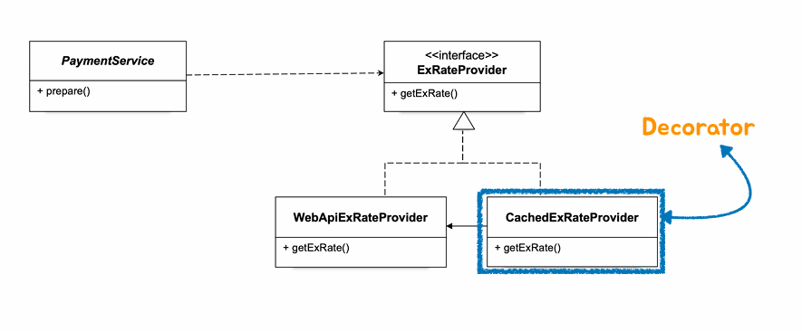

# 10.DI와_디자인패턴

DI 와 디자인 패턴디자인 패턴을 구분하는 두 가지 방식이 있다. 하나는 사용 목적(purpose)이고 다른 하나는 스코프(scope)이다. 스코프에 의해서 분류하면 클래스 패턴과 오브젝트 패턴으로 나눌 수 있다. 클래스 패턴은 상속(inheritance)을 이용해서 확장성을 가진 패턴으로 만들어지고, 오브젝트 패턴은 합성 (composition)을 이용한다. 대부분의 디자인 패턴은 오브젝트 패턴이다. 가능하면 오브젝트 합성을 상속보다 더 선호하라는 디자인 패턴의 기본 객체지향 원리를 따른 것이다.

 

## 데코레이터 패턴

**데코레이터(Decorator**)는 새로운 동작을 객체에 연결할 수 있는 구조적 디자인 패턴으로, 이러한 객체를 동작을 포함하는 특수 래퍼 개체 안에 배치할 수 있습니다.
(오브젝트에 부가적인 기능/책임을 동적으로 부여하는 디자인패턴)

---

### 현재 코드 개선이 필요한 부분

만약 `PaymentService`의 분당 호출이 많은 경우에 매번 WebApi를 사용해서 환율정보를 불러오는 것은 속도면에서 좋지않다. 환율정보가 변하는 특정 타이밍에 딱 변화정보를 가져와서 캐싱하고, 요청이 들어오면 캐싱된 환율정보를 사용하는 것이 속도가 빠를것이다.
캐싱을 도입하기 위해 `WebApiExRateProvider` 코드 수정이 필요한데 이번에는 데코레이터 패턴을 이용해서 `WebApiExRateProvider` 코드수정 없이 기능을 추가해서 사용하는 코드를 작성할 것이다. 

이런 구조가 될 것이고,  런타임에 `PaymentService` 와`WebApiExRateProvider`  사이에 `CachedExRateProvider`가 추가되는 형태가 된다. 