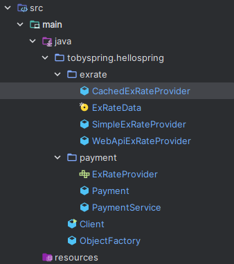

# 11.의존성_역전\_원칙(DIP)

> **추상화에 의존해**야 구체화에 의존하면 안된다.
> 하위 모듈이 상위 모듈에 의존해야 한다.

DIP를 프로젝에 적용시키기 위해서는 Separate Interface 패턴을 적용한다.

### **Separate Interface 패턴**

객체지향 설계에서 **인터페이스와 구현을 분리**하여 시스템의 유연성과 확장성을 높이는 설계 패턴입니다. 이 패턴은 주로 클라이언트 코드가 구현 세부 사항에 의존하지 않고, 인터페이스에만 의존하도록 설계함으로써 **느슨한 결합(loose coupling)**을 실현합니다.

---

**적용한 구조**

**상위/하위 모듈의 의존성 역전 원칙(DIP)**

- 의존성 역전 원칙에 따라 **상위 모듈(PaymentService)**과 **하위 모듈(CachedExRateProvider, WebApiExRateProvider)** 모두 추상화된 인터페이스(ExRateProvider)에 의존해야 합니다.

하위 모듈이 상위 모듈을 의존해야 하는데 둘 다 추상화에 의존하는 형태를 만들려면, 현재 구조로 만들어야 함.

**현재 의존 관계** 
PaymentService => ExRateProvider(Interface)
CachedExRateProvider => ExRateProvider(Interface)

인터페이스 ExRateProvider를 상위 패키지에 위치 시킴

(의존 관계는 쉽게 말해서 사용하는 관계다 라고 생각하면 편함 A =>B : A가 B를 사용함  = A가 B를 의존함 = A와B는 의존관계다.)

---

### 사용 이유

1. **결합도 감소**: 클라이언트가 인터페이스를 통해 의존하므로 구현체의 변경이 클라이언트 코드에 영향을 주지 않음.
2. **테스트 용이성**: 인터페이스를 통해 Mock 객체를 쉽게 만들어 테스트 가능.
3. **다양한 구현 허용**: 동일한 인터페이스를 사용해 여러 구현체를 교체 가능.

---

